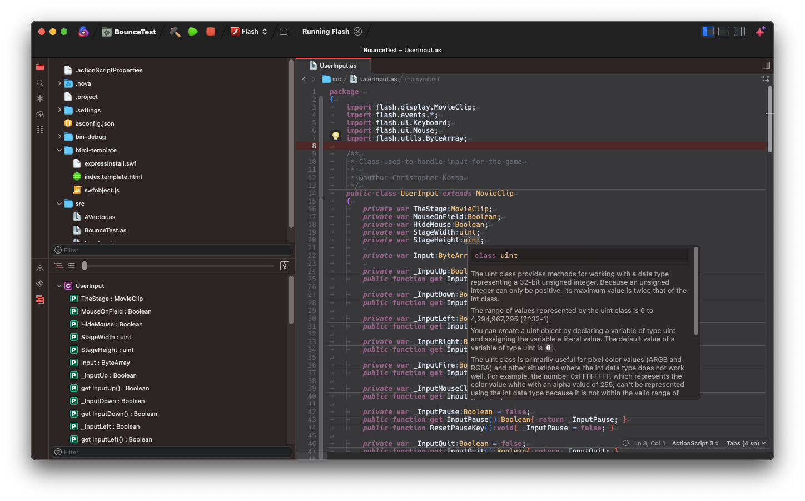
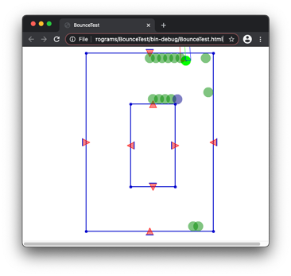

# ActionScript 3 and MXML for Nova

Is a **Work In Progress** extension for ActionScript 3 & MXML.

The goal was to be able to have a replacement for all my old Adobe Flash Build projects, so that I didn't need to create an new file to handle building or running, but that the IDE's extension would do all the lifting. Ideally, it will just read the old Flash Builder settings and set everything up for me (which is getting pretty close to that).

It currently provides:

 * **Syntax Highlighting**

 * **Code Folding**

 * **Symbols** - *Note:* Self-closed MXML and children nodes do not show up correctly in the hierarchy.

 * **Issues** - *Via AS3MXML*

 * **Language intelligence** - *Via AS3MXML*

 * **Completions** for the following:
   * **ActionScript 3**
   * **MXML** - *Note:* Still a little wonky
   * **AIR Descriptor XML** - Include descriptions on most of the AIR Descriptors tags!

 * **Clips**

 * **Tasks** - Use Nova's Clean/Build/Run for AIR desktop project, mobile project (currently, only through Desktop simulator), and Flash web based project (using either SWFObject from the AIR SDK or a very basic page using Ruffle). Also, limited support for packaging with ANEs.

 * **Exporting AIR Packages** - AIR, AIRI, Captive bundles, and native installer for Mac should work (have not tested submitting to app store for Mac apps). Android and iOS packaging should work (again, I have not tested submitting them to app stores).

## Todo

 * Automatically managing library builds
 * Launching AIR projects on actual devices (Android and iOS)
 * Workers
 * Modules

## Notes

The LSP used is [BowlerHatLLC/vscode-as3mxml](https://github.com/BowlerHatLLC/vscode-as3mxml) V1.21.1 but Cleaning/Building/Running and Export Packaging are done by this extension using `mxmlc` for compiling of Flash and AIR project and packaging, `compc` is used for compiling libraries, and the running is done with `adt` from an (Harman) Adobe Air or Flex SDK.

For the Issues, language intelligence and completions to work, it requires an `asconfig.json` in the project folder. The extension will attempt to auto-generate one. If you have used the VSCode extension, you can disable the automatic generation in the configurations (and the prompt when first opening the project).

## Requirements

ActionScript 3 and MXML for Nova requires the following (besides Nova) to be installed on your Mac:

* **Java**

  * You may need JDK 11+ to avoid problems with ANEs. Sometimes `mxmlc` will return `"Error: null"` when using Java 1.8.

* **(Harman) Adobe Air** or **Flex SDK**

  * Default location looked for is at `~/Applications/AIRSDK`, if you have others, your will need to change the extension settings.

## Optional

* **Flash Player**

  * You can still use a standalone Flash Player to launch Flash projects

* **Ruffle**

  * You can also use Ruffle standalone if you want to launch a Flash project, instead of Flash Player. There may be some additional prompting to allow it to run the projects if you launch it from Nova.

* Old version (prior to V88) of **Chrome** or **Chromium** and **PPAPI Flash Player**

  * If you really want to live dangerously, why not throw on an old version of Chrome or Chromium and an old version (not like there's a new one) of the PPAPI Flash Player. You can configure it to run your project so that it launches it through a alternate browser.

  

## Usage

It should work if you open a files `*.as`, or `*.mxml`. If it's not a project with an `.asconfig` file, code intelligence and issue will not work.

### Flash Builder projects

While Flash Builder is no longer supported by Adobe, this extension allows users to migrate their existing project for use in Panic Nova. If you open a folder that contains an Adobe Flash Builder project (and has `.actionScriptProperties`, `.flexProperies`, and `.project`), it will ask if you want to import the Flash Builder project and change your Nova project's settings. It will also generate Tasks for each build target that there was in the Flash Builder project and set their preferences.

If you want, you can also change this setting in the **Extensions → Settings → Additional Options...** and disable it. You can use the menu option **Extensions → ActionScript 3 → Import FlashBuilder settings...** to change your project's settings to those used by a Flash Builder project at your request.

### Code Intelligence/Issues

Since the LSP AS3MXML requires requires an `asconfig.json` for most of the code intelligence and completions, the extension will ask if you want to have it generate one and automatically update it. If you select update, it should only change options that are needed in this extension. Building options are not changed in the `asconfig.json` and not used by this extension.

*NOTE:* If building a Flash project and using the Ruffle template, you will need to use Nova's External Preview since Ruffle does not allow the use of "file:" protocol for loading SWFs.

### Certificates

The extension has the ability to generate certificates for self signing AIR packages. It will also allow you, when packaging to store the password for the certificates for either the session, or store it to your Keychain.

## Configuration

To configure global preferences, open **Extensions → Extension Library...** then select ActionScript 3's **Preferences** tab.

You can also configure preferences on a per-project basis in **Project → Project Settings...**.

Tasks also have a bunch of options too! Don't miss out on **Project → Tasks → Edit Task...**

## Tasks

Task play an important role in build/run as well as exporting of packages. There are different ones available, based on how you plan to run and or package your project. Each project can also include multiple Task, so you can easily switch between building one project for multiple devices. The option to Export Release Build will ask which Task to export.

*  **AIR** - Use this to be able to build/run/export Adobe AIR project for desktop. You should be able to generate AIR packages, Mac Apps, and Mac installers with this Task type.

*   **AIR - Android** - Use this for packaging for Android devices.

*   **AIR - iOS** - Use this to allow for packaging for iOS devices.

*   **Flash** - Use this to be able build for web. There are options to make it for web using old style SWFObject and a light-weight Ruffle html page.

*   **Library** - This can be used to make an Flex library (*NOTE:* Not fully tested)

