# ActionScript 3 and MXML for Nova

🚀 **Work In Progress** 🚀

This extension brings **ActionScript 3 and MXML** support to **Panic Nova**.

The goal was to be use all my old Adobe Flash Build projects and convert them to Nova's workflow. I wanted to be able to build and run projects in Nova without additional setup, just by importing the Flash Builder settings when opening the project. (It's pretty close to it!)

## ✨ Features

- 🐛 **Debugging** - _Via SWF Debug_ - _(Still WIP)_

- 🖍️ **Syntax Highlighting**

- 📁 **Code Folding**

- 📚 **Symbols** - _Note:_ Self-closed MXML and children nodes do not show up correctly in the hierarchy.

- ⚠︎ **Issues** - _Via AS3MXML_

- 🧪 **Language intelligence** - _Via AS3MXML_

- 💡 **Completions** for the following:

  - **ActionScript 3**

  - **MXML** - _Note:_ Still a little wonky

  - **AIR Descriptor XML** - Include descriptions on most of the AIR Descriptors tags!

- 📎 **Clips**

- ▶️ **Tasks**

  - Use Nova's Clean/Build/Run for AIR desktop project, mobile project (currently, only through Desktop simulator), and Flash web based project (using **SWFObject** from the AIR SDK or a very basic page using **Ruffle**). Also, limited support for packaging with ANEs.

- 📦 **Exporting AIR Packages**

  - AIR, AIRI, Captive bundles, and native installer for Mac should work (_untested for submitting to app stores_).
  - Android and iOS packaging _should_ work (_untested for App Store submission_).

- **Creating New Project**

## ☑️ Todo

- **Launching AIR projects on actual devices** - Android and iOS
- **Locale** - Current set to use en_US
- **Themes**
- **ANE** Handling, unpacking to "tmp" folder
- **Library** - Automatically managing library builds
- **Workers**
- **Modules**
- **MXML** - Nova shows the MXML fine on first load, however, after saving it sometime flags a lot of issues.

## 📝 Notes

For Issues, language intelligence and completions, the LSP used is [BowlerHatLLC/vscode-as3mxml](https://github.com/BowlerHatLLC/vscode-as3mxml) V1.22.0.
For Debugging, [Bowler Hat's SWF Debug](https://github.com/BowlerHatLLC/vscode-swf-debug) V1.10.0

AS3MXML requires an `asconfig.json` in the project folder. The extension will attempt to auto-generate one. If you have used the VSCode extension, and have one already, you can disable the automatic generation and updating in the configurations or with the prompt when first opening the project.

Cleaning/Building/Running and Export Packaging are done by this extension using binaries from the (Harman) Adobe Air or Flex SDK:
- `mxmlc` for compiling of Flash and AIR project and packaging,
- `compc` is used for compiling libraries
- `adt` is used for running (checking for devices and making certificates)

## 📋 Requirements

ActionScript 3 and MXML for Nova requires the following (besides Nova) to be installed on your Mac:

- **Java (JDK 11+)** - AS3MXML requires it, and it also avoids issues with `mxmlc` returning `"Error: null"` when using Java 1.8.

- **(Harman) Adobe Air** or **Flex SDK** - Default path is `~/Applications/AIRSDK` (but can be changed in the extension settings)

- **Rosetta 2** (for Apple Silicon Macs) - Required to run SDK tools

### Optional

These are only needed if you plan on running Flash Player projects:

- **Flash Player** (Standalone) - If trying to run Flash projects

- **Ruffle** - Can also run Flash projects. _NOTE:_ There may be some additional prompting to allow it to run the projects if you launch it from Nova.

- **Old Chrome/Chromium with PPAPI Flash Player** - Version prior to V88 should be able to run in browser

  

## 🚀 Usage

Open an `*.as`, or `*.mxml` and it should work. However, there are a few things that need to be setup to get the full functionality:

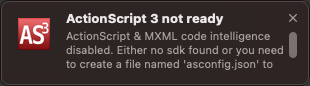

### SDK Setup

By default, the extension will look to `~/Applications/AIRSDK` for the AIR SDK to use. If you need to change that:

1. Go to **Extensions → Extension Library...** then select ActionScript 3's **Preferences** tab.
2. Update `Default AIR SDK path`

You can also set a specific SDK per project under

1. Go to **Project → Project Settings...**
2. Scroll down to the **Compiler → AIR/Flex SDK version** section.

### Code Intelligence and Issues

Since the LSP AS3MXML requires requires an `asconfig.json` for code intelligence,  completions, and issues, you will need a file in your project's root. When opening a project you will get prompted:

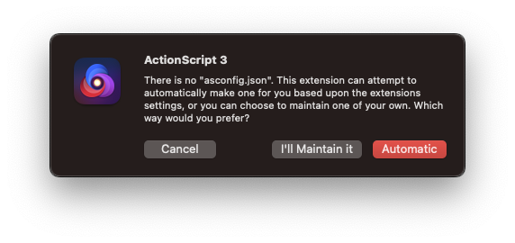

- **Automatic** - If you select this, when project's settings are changed, the extension will modify the `asconfig.json`. If there is an existing `asconfig.json`, it will be backed up and timestamped.

- **I'll Maintain it** - This will not create or modify an `asconfig.json` file. Just remember, you need one for code intelligence and issues!

- **Cancel** - Skip, but will prompt you every time you open the project.

If the extension handles your `asconfig.json`, only the options used by this extension are changed. Since the building is not handled by AS3MXML, most of the compiling and packaging setting are not modified.

### Making Nova feel more like Flash Builder

There are some additional options to make Nova feel more Flash Builder like are also options that you can change. These will affect projects that have been either created with this extension or imported from Flash Builder:

- **Open output on run** - This opens the report window when you run a Task, similar to the Console window in Flash Builder

- **Build on run** - This will force building before running

## ⚙️ Import Flash Builder project

While Flex Builder / Flash Builder are no longer supported by Adobe, this extension allows users to migrate their existing project for use in Panic Nova. If your project contains  `.actionScriptProperties`, `.project`, and `.flexProperies` or `.flexLibProperies`, the extension defaults to prompting you to import the settings:

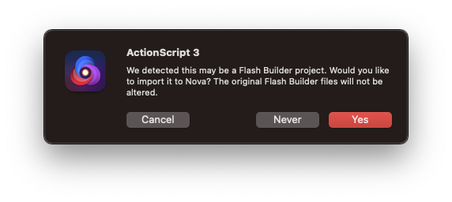

- **Yes** - Converts the Flash Builder project and modify the Nova project's settings.

- **Never** - Will not import and won't ask again.

- **Cancel** - Will not import, but will ask you next time.

If you want, you can also change this setting in the **Extensions → Settings → Additional Options... → Prompt to import Flash Builder projects** and disable it.

You can also use the menu option **Extensions → ActionScript 3 → Import Flash Builder project...** to change your project's settings to those used by a Flash Builder project when ever you feel like it.

## 🆕 New Projects

You can also use the menu option **Extensions → ActionScript 3 → Create New AS3/Flex Project...**.

- **Flex Projects** - Creates an MXML based project. It will ask if you want to make it an **AIR** or **Flash** based project.

- **Flex Library** - Lets you create an ActionScript based library in one of two flavors:
  - **Generic** - Can be used with either web, desktop, or mobile projects
  - **Mobile** - Can only be used with mobile application

- **Flex Mobile Project** - Creates an MXML based mobile project, which you decide how the views are based:
  - **Tabbed** - Includes a tab bar to switch between views in the application
  - **View** - Offers different views that can be switched in the application
  - **Blank** - Simple, one view for displaying the application

- **ActionScript Project**  - It will ask if you want to make it an **AIR** or **Flash** based project.

- **ActionScript Mobile Project** - Creates an AIR based mobile application

#### SDKs

Currently, there is no list of SDKs like Flash Builder, if the import reads the name of the SDK from the Flash Builder project, it will reminded you to update your project's SDK settings:

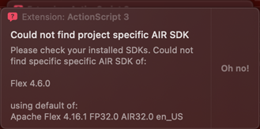

You can change the SDK by:

 1. Go into your **Project → Project Settings...**
 2. Scroll down to the **Compiler → AIR/Flex SDK version**.

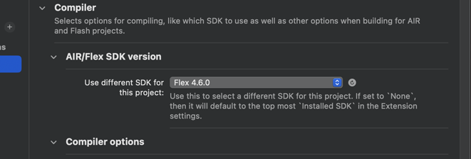

#### Additional Notes about project import

The importing may also import may also setup more Tasks than needed, especially if was a mobile project. If you run into building issues like below, it may be that you need to change the Task to a mobile device Task and try building/running. Feel free to remove the desktop AIR task.

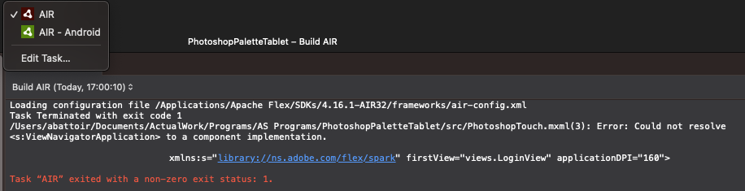

### Old Flex/AIR SDKs

Prior to AIR SDK 20, some of the executables were still 32bit. Unfortunately, these won't run on anything after Mac OS 10.5. If you are using an older version of an SDK, you will get a warning about this:

  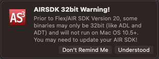

 - **Understood** - The message will pop up every time you open the project
 - **Don't Remind Me** - This will not show up again, unless you change the SDK that is being used. It will be reset every time you change SDKs.

That doesn't mean it won't still build, but if you try to play or package may fail:

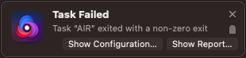

Click on the show reports and if you see something like this:

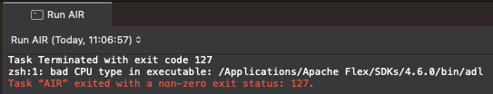

This means that ADL is still 32bit, and won't run. If you want to also run from Nova, you will need to update your SDK to AIR 20+. Then you will need to update your *app.xml* for the namespace, but if it's really old you may need to include a `<versionNumber>` element (and make sure it's only numbers). Don't worry, the extension should remind you!

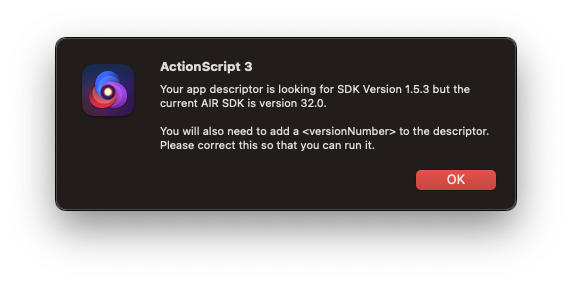

## Themes Support is _Incomplete_

### Halo Theme issues

_NOTE:_ Currently, when importing from Flash Builder, it will gather information about the theme, but the process of using this information for building with it has not been completed!

There is an option that will allow you to build older Flex 3 projects that require embedding Halo with the build. If you try to build and run into errors that say something like  `is only supported by type ... with the theme(s)`, as shown here:

you can go to the project's preferences and check the option:

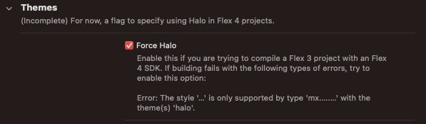

This will force `mxmlc` to compile and embed the Halo theme, allowing Flex 4 to set some styles that can only be modified if the `halo.swc` is compiled with it!

## 🔐 Certificates

The extension has the ability to generate certificates for self signing AIR packages using ADL. To create a self-signed certificate:
- Go to **Extensions → ActionScript 3 → Create new Certificate**

   Nova will then prompt you with several questions and allow you to generate a new self-signing certificate.

If your project or Tasks have certificates, you can store a certificate password in your Keychain:
- Go to **Extensions → ActionScript 3 → Store Certificate Password**

 If there is more than one certificate, you will get a prompt to select which certificate to store. You must do it one at a time.

To clear the certificate password from your Keychain:
- Go to **Extensions → ActionScript 3 → Clear Certificate Password**

 If you have stored one or more certificates, then it will prompt to select "All" or a particular certificate to remove.

## 📦 Export Release Build

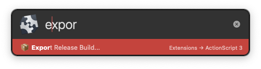

This allows you to package AIR projects. Make sure you have your certificate created, if not, then take a look above!

If you have multiple Tasks, and you try to export a release build it will ask which one you want. The extension will also store the last one selected, so it will pick that by default.

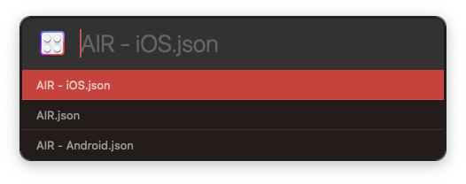

Next, it will prompt you for you certificate password, and if it's good, it will ask you if you want to use it just this one time, save it to your Keychain, or use for the session.

### Timestamp Errors

One minute it works, next minute it doesn't.

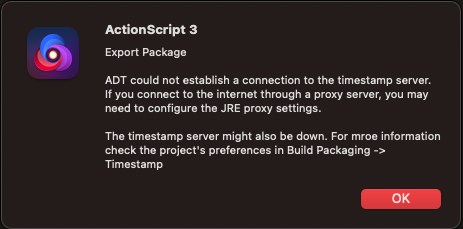

If just testing locally on your own devices, you can just change the project's settings to skip the timestamp or you can supply your own  RFC3161-compliant timestamp server URL. Go to

 1. **Project → Project Settings...**
 2. Scroll down to the **Build Packaging** section:

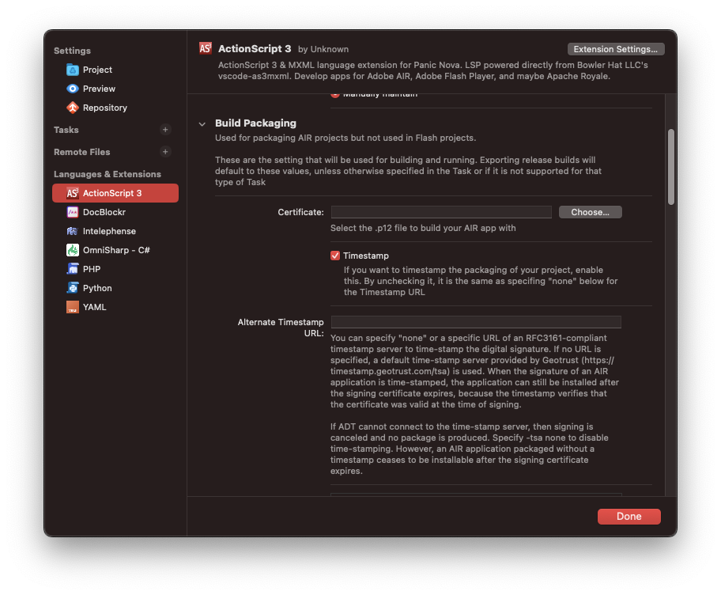

## ⚙️ Configuration

Remember, there's a ton of configs, and in different places:

 - **Global preferences** - Open **Extensions → Extension Library...** then select ActionScript 3's **Preferences** tab.

 - **Project preferences** - You can also configure preferences on a per-project basis in **Project → Project Settings...**.

 - **Task preferences** - Tasks also have a bunch of options too! Don't miss out on **Project → Tasks → Edit Task...** or if you click on the Task dropdown and selecting **Edit Task...** and then selecting the appropriate Task.

## ▶️ Tasks

Task play an important role in build/run as well as exporting of packages. There are different ones available, based on how you plan to run and or package your project. Each project can also include multiple Task, so you can easily switch between building one project for multiple devices. The option to Export Release Build will ask which Task to export.

-  **AIR** - Desktop builds.

-   **AIR - Android** - Packaging for Android devices.

-   **AIR - iOS** - Packaging for iOS devices.

-   **Flash** - Web Builds (supports SWFObject and Ruffle)

  If building a Flash project and using the Ruffle template for web, you will need to use Nova's External Preview option to run since Ruffle does not allow the use of `file:///` protocol for loading SWFs in a browser.

  Also, don't forget that closing the window on Flash Player, it does not quit it so Nova will still think the Task is running. If you go to run again, you may want to Stop so that it will only have one process running, or you can Add if you want to have multiple things open. It's kinda useful if you need to compare your changes.

  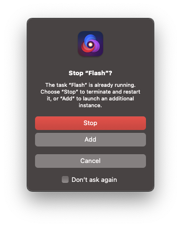

  In the **Global preferences** setting, you can set up the locations of Flash Player, Ruffle, and a old browser to use for launching if you scroll down to the Flash Player Run/Debug section:

  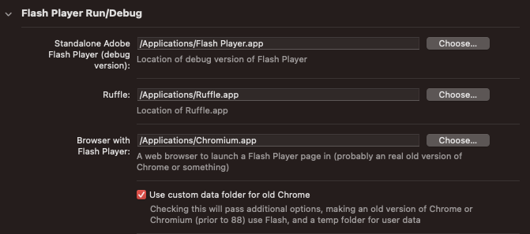

  If you edit the Task settings, you can change how to launch it:

  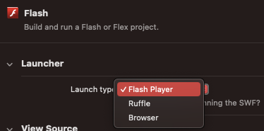

-   **Library** - This can be used to make an Flex library (*NOTE:* Not fully tested, and needs some more work.)

As of V0.8.2, you can now set custom build/run main application files and destination folders, allowing you to launch multiple Tasks at the same time with a different project. This can be useful if you want to build and run a desktop, Android and iOS build from the same code base at the same time!

## 💡 Tips and Tricks

### Viewing `trace()` output

 1. Going into **Project → Tasks → Edit Task...**
 2. Select the Task you want.
 3. Scroll all the way to the bottom, change the Task's **Open Report** drop down to **On Run**.

  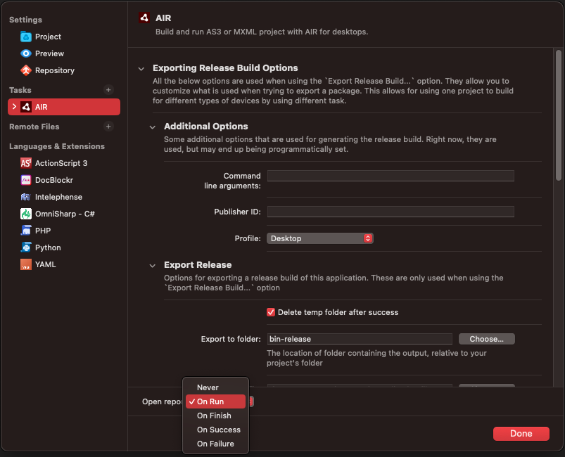

  Then a window with the output will show up when you run:

  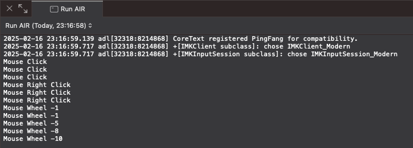

### Force build before running

 1. Going into **Project → Tasks → Edit Task...**.
 2. Expand the Task you want to modify.
 3. Select the **Run** option.
 4. Then you can check off **Build before running**.

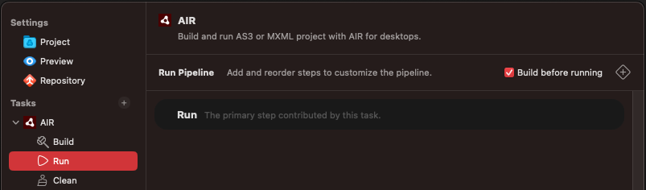

## 🏆 Acknowledgements

This extension uses:

- **[AS3MXML](https://github.com/BowlerHatLLC/vscode-as3mxml)**: by [Bowler Hat LLC](https://bowlerhat.dev/) - [John Tynjala](https://www.patreon.com/josht)

- **[Ruffle](https://ruffle.rs/)**: A link to the CDN with the nightly build is included if you make a Flash Task and select the use Ruffle.

### ⚖️ Disclaimer

This extension is **not affiliated with, endorsed by, or sponsored by** Adobe Inc or HARMAN International.

"Adobe", "Flash", "Flash Player", "Flex Builder", "Flash Builder", and "Adobe AIR" are trademarks or registered trademarks of **Adobe Inc**. in the United States and other countries.
