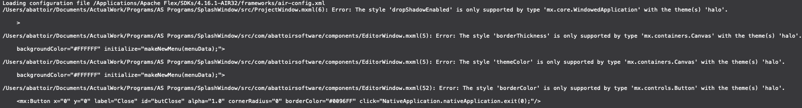

# ActionScript 3 and MXML for Nova

Is a **Work In Progress** extension for ActionScript 3 & MXML.

The goal was to be able to have a replacement for all my old Adobe Flash Build projects, so that I didn't need to create an new file to handle building or running, but that the IDE's extension would do all the lifting. Ideally, it will just read the old Flash Builder settings, I could hit build and then run and be done. (So far, for my projects, it seems to be doing that)

It currently provides:

 * **Syntax Highlighting**

 * **Code Folding**

 * **Symbols** - *Note:* Self-closed MXML and children nodes do not show up correctly in the hierarchy.

 * **Issues** - *Via AS3MXML*

 * **Language intelligence** - *Via AS3MXML*

 * **Completions** for the following:
   * **ActionScript 3**
   * **MXML** - *Note:* Still a little wonky
   * **AIR Descriptor XML** - Include descriptions on most of the AIR Descriptors tags!

 * **Clips**

 * **Tasks** - Use Nova's Clean/Build/Run for AIR desktop project, mobile project (currently, only through Desktop simulator), and Flash web based project (using either SWFObject from the AIR SDK or a very basic page using Ruffle). Also, limited support for packaging with ANEs.

 * **Exporting AIR Packages** - AIR, AIRI, Captive bundles, and native installer for Mac should work (have not tested submitting to app store for Mac apps). Android and iOS packaging should work (again, I have not tested submitting them to app stores).

## Todo

 * Launching AIR projects on actual devices (Android and iOS)
 * Locale - current set to use en_US
 * Automatically managing library builds
 * Workers
 * Modules

## Notes

The LSP used is [BowlerHatLLC/vscode-as3mxml](https://github.com/BowlerHatLLC/vscode-as3mxml) V1.21.1 but Cleaning/Building/Running and Export Packaging are done by this extension using `mxmlc` for compiling of Flash and AIR project and packaging, `compc` is used for compiling libraries, and the running is done with `adt` from an (Harman) Adobe Air or Flex SDK.

For the Issues, language intelligence and completions to work, it requires an `asconfig.json` in the project folder. The extension will attempt to auto-generate one. If you have used the VSCode extension, you can disable the automatic generation in the configurations (and the prompt when first opening the project).

## Requirements

ActionScript 3 and MXML for Nova requires the following (besides Nova) to be installed on your Mac:

* **Java**

  * You may need JDK 11+ to avoid problems with ANEs. Sometimes `mxmlc` will return `"Error: null"` when using Java 1.8.

* **(Harman) Adobe Air** or **Flex SDK**

  * Default location looked for is at `~/Applications/AIRSDK`, if you have others, your will need to change the extension settings.

* If you are on a Apple silicon Mac, **Rosetta 2**

  * If you don't have it, whenever this tries to build or run something you'll get the window asking if you want to install Rosetta.

## Optional

* **Flash Player**

  * You can still use a standalone Flash Player to launch Flash projects

* **Ruffle**

  * You can also use Ruffle standalone if you want to launch a Flash project, instead of Flash Player. There may be some additional prompting to allow it to run the projects if you launch it from Nova.

* Old version (prior to V88) of **Chrome** or **Chromium** and **PPAPI Flash Player**

  * If you really want to live dangerously, why not throw on an old version of Chrome or Chromium and an old version (not like there's a new one) of the PPAPI Flash Player. You can configure it to run your project so that it launches it through a alternate browser.

  

## Usage

It should work if you open a files `*.as`, or `*.mxml`. But of course, you may need to set a few things up first!

### SDK Setup

By default, the extension will look to `~/Applications/AIRSDK` for the AIR SDK to use. If you need to change that, make sure you go into the **Extensions → Extension Library...** then select ActionScript 3's **Preferences** tab. There's an entry for the `Default AIR SDK path`. Also, each project can target a specific SDK if need be. That is handled in **Project → Project Settings...**, down in the **Compiler → AIR/Flex SDK version** section.

### Code Intelligence and Issues

Since the LSP AS3MXML requires requires an `asconfig.json` for most of the code intelligence and completions, you will need this in your project's root. If one is not found, then the extension will ask if you want to have it generate one and automatically update it.

If you do have a `asconfig.json` file, you will also get prompt with these options:

 * **Automatic** - If you select this, when changes to the project's settings are made the extension will only modify the `asconfig.json` values that are needed in this extension. Building options are not changed in the `asconfig.json` and not used by this extension. If there is an existing one, it will back it up and timestamp the file for safe keeping.

 * **I'll Maintain it** - This will tell the extension to not modify the file in anyway, and it won't ask you again.

 * **Cancel** - This will not create or update the file, and it will prompt you every time you open the project unless you select one of the other options.

### Flex/Flash Builder project import

While Flex Builder / Flash Builder are no longer supported by Adobe, this extension allows users to migrate their existing project for use in Panic Nova. If you open a folder that contains a Flex or Flash Builder project (and has `.actionScriptProperties`, `.project`, and `.flexProperies` or `.flexLibProperies`), it will ask if you want to import the Flash Builder project and change your Nova project's settings. It will also generate Tasks for each build target that there was in the Flash Builder project and set their preferences.

 * **Yes** - Will grab the information from Flash Builder project and modify the project's settings.

 * **Never** - Won't import anything and will stop asking to do this when you open this project.

 * **Cancel** - Will not import the Flash Builder project, but it will ask you each time until you answer either Yes or Never.

If you want, you can also change this setting in the **Extensions → Settings → Additional Options... → Prompt to import Flash Builder projects** and disable it. You can use the menu option **Extensions → ActionScript 3 → Import FlashBuilder settings...** to change your project's settings to those used by a Flash Builder project when ever you feel like it too.

Currently, there is no list of SDKs like Flex/Flash Builder, if it reads from the Flash Builder project the SDK name it will reminded you that you have to update your project's SDK settings:

You can go into your **Project → Project Settings...** and scroll down to the **Compiler → AIR/Flex SDK version**.

#### Additional Notes about project import

The importing may also import may also setup more Tasks than needed, especially if was a mobile project. If you run into building issues like below, it may be that you need to change the Task to a mobile device Task and try building/running. Feel free to remove the desktop AIR task.

### Old Flex/AIR SDKs

Prior to AIR SDK 20, some of the executables were still 32bit. Unfortunately, these won't run on anything after Mac OS 10.5. If you are using an older version of an SDK, you will get a warning about this.

You can click on "Understood", and the message will pop up every time you open the project. If you click "Don't Remind Me", it will not show up again, unless you change the SDK that is being used. It will be reset every time you change SDKs.

This doesn't mean it won't still build, but if you try to play or package may fail:

Click on the show reports and if you see something like this:

it means that ADL is still 32bit, and won't run. If you want to also run from Nova, you will need to update your SDK to AIR 20+. Then you will need to update your *app.xml* for the namespace, but if it's really old you may need to include a `<versionNumber>` element (and make sure it's only numbers). Don't worry, the extension should remind you!

### Themes - Halo Theme issues

*NOTE: Under construction*. Currently, when importing from Flash Builder, it will gather information about the theme, but the process of building with it has not been completed!

However, there is an option that will allow you to build older Flex 3 projects that require embedding Halo with the build. If you try to build and run into errors like this:

you can go to the project's preferences and check the option:

This will force `mxmlc` to compile and embed the Halo theme, allowing Flex 4 to set some styles that can only be modified if the `halo.swc` is compiled with it!

### Certificates

The extension has the ability to generate certificates for self signing AIR packages. **Extensions → ActionScript 3 → Create new Certificate**. Nova will then prompt you with several questions and allow you to generate a new self-signing certificate.

If your project has Tasks that specify a certificate, you can also use the menu options of **Extensions → ActionScript 3 → Store Certificate Password** to store the password, or **Extensions → ActionScript 3 → Clear Certificate Password** to clear the password from your Keychain.

It will also allow you, when packaging to store the password for the certificates for either the session, or store it to your Keychain.

### Export Release Build

This allows you to package AIR projects. Make sure you have your certificate created, if not, then take a look above!

If you have multiple Tasks, and you try to export a release build it will ask which one you want. The extension will also store the last one selected, so it will pick that by default.

Next it will prompt you for you certificate password, and if it's good, it will ask you if you want to use it just this one time, save it to your Keychain, or use for the session.

#### Timestamp

One minute it works, next minute it doesn't.

If just testing locally on your own devices, you can just change the project's settings to skip the timestamp or you can supply your own  RFC3161-compliant timestamp server URL. Just take a look in **Project → Project Settings...** and scroll down to the **Build Packaging** section:

## Configuration

Remember, there's a ton of configs, and in different places:

  * **Global preferences** - Open **Extensions → Extension Library...** then select ActionScript 3's **Preferences** tab.

  * **Project preferences** - You can also configure preferences on a per-project basis in **Project → Project Settings...**.

  * **Task preferences** - Tasks also have a bunch of options too! Don't miss out on **Project → Tasks → Edit Task...** or if you click on the Task dropdown and selecting **Edit Task...** and then selecting the appropriate Task.

## Tasks

Task play an important role in build/run as well as exporting of packages. There are different ones available, based on how you plan to run and or package your project. Each project can also include multiple Task, so you can easily switch between building one project for multiple devices. The option to Export Release Build will ask which Task to export.

*  **AIR** - Use this to be able to build/run/export Adobe AIR project for desktop. You should be able to generate AIR packages, Mac Apps, and Mac installers with this Task type.

*   **AIR - Android** - Use this for packaging for Android devices.

*   **AIR - iOS** - Use this to allow for packaging for iOS devices.

*   **Flash** - Use this to be able build for web. There are options to make it for web using old style SWFObject and a light-weight Ruffle html page.

  If building a Flash project and using the Ruffle template for web, you will need to use Nova's External Preview option to run since Ruffle does not allow the use of `file:///` protocol for loading SWFs in a browser.

  Also, don't forget that closing the window on Flash Player, it does not quit it so Nova will still think the Task is running. If you go to run again, you may want to Stop so that it will only have one process running, or you can Add if you want to have multiple things open. It's kinda useful if you need to compare your changes.

  

  In the **Global preferences** setting**, you can set up the locations of Flash Player, Ruffle, and a old browser to use for launching if you scroll down to the Flash Player Run/Debug section:

  

  If you edit the Task settings, you can change how to launch it:

  

*   **Library** - This can be used to make an Flex library (*NOTE:* Not fully tested, and needs some more work.)

## Tips and Tricks

### Trace output

If you miss seeing all your project's `trace()` statements when you are running a project, you can do so  by going into **Project → Tasks → Edit Task...** then select the Task you want. Scroll all the way to the bottom, and change the Task's "Open Report" drop down to "On Run" so that it will show the AIR output:

Then a window with the output will show up when you run:

### Build before running

If you want to force Nova to build before running, you can also edit the Task, expand it to select the **Run** option. Then you can check off "Build before running"

Yeah, that one of the neat tricks of Nova!

## Acknowledgements

This extension uses [AS3MXML](https://github.com/BowlerHatLLC/vscode-as3mxml) which is a work of [Bowler Hat LLC](https://bowlerhat.dev/) - [John Tynjala](https://www.patreon.com/josht)

This extension is not affiliated with, endorsed by, or sponsored by Adobe Inc.
"Adobe", "Flash", "Flex Builder", "Flash Builder", and "Adobe AIR" are trademarks or registered trademarks of Adobe Inc. in the United States and other countries.

A link to the CDN with the nightly build of [Ruffle](https://ruffle.rs/) is included if you make a Flash Task and select the use Ruffle.
